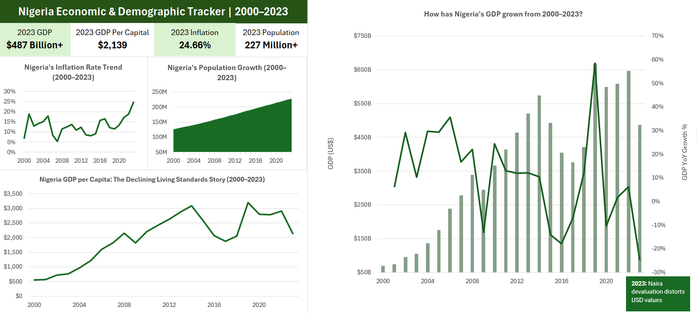

# Nigeria Economic & Demographic Tracker | 2000–2023



---

## 📌 Project Overview

This project analyses Nigeria's key economic and demographic indicators across a 24-year period (2000–2023) using verified data from the World Bank. The goal was to build a data-driven dashboard that tells Nigeria's economic story — from the oil boom years of the mid-2000s, through the 2016 recession, the COVID-19 disruption, and the 2023 naira devaluation — using Excel, Power Query, Power Pivot, and DAX.

This project is locally relevant and globally positioned — Nigeria is Africa's largest economy and most populous nation, making its economic trajectory a subject of interest to international investors, policymakers, development organisations, and researchers worldwide.

---

## 🎯 Business Questions Answered

- How has Nigeria's GDP grown from 2000 to 2023, and what caused the major dips?
- What does GDP per capita reveal about the average Nigerian's living standards over time?
- How has inflation behaved across 24 years, and what triggered the 2023 spike?
- How fast is Nigeria's population growing, and what does that mean for economic output per person?

---

## 📈 Key Findings

1. **Nigeria's GDP grew from $69B in 2000 to $487B in 2023** — a 7x increase over 24 years, driven largely by oil revenues, rebasing of the economy in 2014, and nominal growth. However, this headline figure masks significant underlying challenges.

2. **GDP per capita peaked at $3,203 in 2014 and declined to $2,139 by 2023** — despite total GDP growing, the average Nigerian became poorer in USD terms after 2014. This is explained by two factors: population growing faster than economic output, and the naira losing significant value against the dollar.

3. **Inflation surged to 24.66% in 2023 — the highest in over two decades** — after a period of relative stability between 2012–2019 (averaging ~11%), inflation accelerated sharply following the removal of fuel subsidies and the naira devaluation under the Tinubu administration in 2023.

4. **Nigeria's population grew from 126 million in 2000 to 227 million in 2023** — an 80% increase in 23 years. At this growth rate, Nigeria is on track to become the world's third most populous country by 2050, which has profound implications for GDP per capita, infrastructure, employment, and food security.

5. **The 2023 GDP contraction in USD terms is a currency effect, not an economic collapse** — the sharp drop visible in the GDP YoY chart at 2023 reflects the naira's devaluation from ~₦460/$ to ~₦1,500/$ rather than an actual shrinkage of Nigeria's real economy. This distinction is critical for accurate economic interpretation.

---

## 🗂️ Data Sources

All data sourced from the **World Bank Open Data** platform — free, publicly available, no login required.

| Indicator | World Bank Code | Coverage |
|---|---|---|
| GDP (current US$) | NY.GDP.MKTP.CD | 2000–2023 |
| GDP per capita (current US$) | NY.GDP.PCAP.CD | 2000–2023 |
| Inflation, consumer prices (annual %) | FP.CPI.TOTL.ZG | 2000–2023 |
| Population, total | SP.POP.TOTL | 2000–2023 |

> **Note:** A fifth indicator (Poverty headcount ratio) was downloaded but excluded from analysis due to only 9 scattered data points across 40 years — insufficient for meaningful trend analysis.

---

## 🧹 Data Preparation — Power Query

This project required more advanced Power Query work than a standard single-file import. Each World Bank CSV downloads in **wide format** (one column per year), which must be reshaped into **tall format** (one row per year) before it can be used in pivot tables or DAX measures.

**Steps applied to each of the 4 files:**
1. Removed top 4 metadata rows → promoted row 5 as headers
2. Filtered to Nigeria only (`Country Code = NGA`)
3. Removed unnecessary columns (Country Name, Country Code, Indicator Code)
4. Removed pre-2000 year columns (1960–1999)
5. **Unpivoted year columns** using "Unpivot Other Columns" — converting wide to tall format
6. Renamed columns to `Indicator`, `Year`, `Value`
7. Set data types: Year → Whole Number, Value → Decimal Number
8. Named each query: `GDP`, `GDP_Per_Capita`, `Inflation`, `Population`

**Combined all 4 queries into one master table:**
- Used **Get Data → Combine Queries → Append** (Three or more tables)
- Resulted in a single `Nigeria_Economics` table: 96 rows × 3 columns
- Loaded as connection only → added to **Power Pivot Data Model**

---

## 🧮 DAX Measures (Power Pivot)

All measures use `CALCULATE` with an `Indicator` filter to isolate each economic series from the combined table.

| Measure | Formula approach | Purpose |
|---|---|---|
| GDP (US$) | `CALCULATE(SUM([Value]), Indicator = "GDP (current US$)")` | Total GDP for selected year |
| GDP per Capita (US$) | `CALCULATE(SUM([Value]), Indicator = "GDP per capita...")` | Per capita output |
| Inflation Rate (%) | `CALCULATE(SUM([Value]), Indicator = "Inflation...")` | Annual CPI change |
| Population | `CALCULATE(SUM([Value]), Indicator = "Population, total")` | Total population |

**GDP YoY Growth %** calculated using pivot table's built-in **Show Values As → % Difference From → Year → (previous)** — a deliberate technique that produces accurate year-over-year comparison without requiring time intelligence DAX functions.

---

## 📊 Dashboard Components

| Chart | Type | Insight delivered |
|---|---|---|
| Nigeria's Inflation Rate Trend | Line chart | 24-year CPI trajectory — oil boom inflation, 2016 dip, 2023 spike |
| Nigeria's Population Growth | Area chart | Consistent 3–4% annual growth from 126M to 227M |
| Nigeria GDP per Capita | Line chart | Peak at $3,203 in 2014, declining to $2,139 by 2023 |
| How has Nigeria's GDP grown? | Combo (Column + YoY line) | GDP growth bars with year-on-year % change line overlay |

**KPI Cards:** 2023 GDP · 2023 GDP per Capita · 2023 Inflation · 2023 Population

**Chart annotation:** "2023: Naira devaluation distorts USD values" — placed on the GDP combo chart to contextualise the sharp 2023 YoY decline as a currency effect rather than real economic contraction.

---

## 📅 Key Historical Events Annotated

| Year | Event | Impact visible in data |
|---|---|---|
| 2005 | Oil boom peak | GDP growth accelerates sharply |
| 2008–09 | Global financial crisis | GDP growth slows, export revenues fall |
| 2014 | GDP peak per capita | Highest living standards in USD terms |
| 2016 | First recession in 25 years | GDP YoY turns negative (-1.6%) |
| 2020 | COVID-19 pandemic | GDP contracts, inflation rises |
| 2023 | Naira devaluation & fuel subsidy removal | GDP in USD terms drops sharply; inflation hits 24.66% |

---

## 🛠️ Tools & Skills Used

- **Microsoft Excel** — dashboard layout, KPI cards, chart formatting
- **Power Query (M Language)** — multi-file import, top row removal, Nigeria filter, Unpivot transformation, multi-query Append
- **Power Pivot** — data model from appended query
- **DAX** — 4 CALCULATE-based measures with indicator filter context
- **Pivot Tables & Charts** — 4 pivot tables feeding 4 charts
- **Custom number formatting** — `$#,##0"B"` for GDP billions, `0.0"%"` for inflation axis

---

## 📁 Repository Structure

```
nigeria-economic-tracker-excel/
├── README.md
├── /data
│   ├── API_NY_GDP_MKTP_CD_DS2_EN_csv.csv
│   ├── API_NY_GDP_PCAP_CD_DS2_EN_csv.csv
│   ├── API_FP_CPI_TOTL_ZG_DS2_EN_csv.csv
│   └── API_SP_POP_TOTL_DS2_EN_csv.csv
└── /screenshots
    └── Nigeria_Economic_Tracker_Dashboard.png
```

> 📁 **Workbook** (hosted on Google Drive)
> 👉 https://docs.google.com/spreadsheets/d/12LXVXxTyY2wR8E-mnpBR2h4KIs0oPbjB/edit?usp=drive_link&ouid=102194032531628971865&rtpof=true&sd=true

---

## 🚀 How to Use

1. Clone this repository:
   ```bash
   git clone https://github.com/TheIbukunLawal/nigeria-economic-tracker-excel.git
   ```
2. Open the workbook via the Google Drive link above in Microsoft Excel (Microsoft 365 or Office Professional Plus required)
3. If prompted, click **Refresh All** under the Data tab to reload from the source CSV files
4. All 4 source CSV files are included in the `/data` folder for local refresh

> **Note:** Power Pivot and DAX require Microsoft 365 or Office Professional Plus. The dashboard will not function on Excel Home or Student editions.

---

## 👤 Author

**Lawal Ibukun**
[GitHub: @TheIbukunLawal](https://github.com/TheIbukunLawal)

*Data Analyst | Excel · Power Query · Power Pivot · DAX | SQL & Power BI (learning) | Open to global opportunities*
